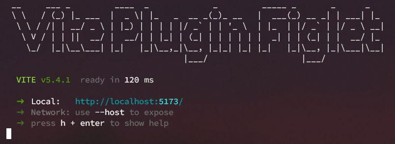

# vite-plugin-figlet

A Vite plugin that allows you to display FIGfont-style text during the startup of your [vite](https://github.com/vitejs/vite) development server.



## Usage

```sh
npm i -D vite-plugin-figlet
```

With default config

```ts
import { defineConfig } from 'vite';
import figlet from 'vite-plugin-figlet';

export default defineConfig({
  plugins: [figlet('Vite Plugin Figlet')],
});
```

With custom font

```ts
export default defineConfig({
  plugins: [
    figlet('Vite Plugin Figlet', {
      font: 'Avatar',
    }),
  ],
});
```

See all [configurable options](https://github.com/DefinitelyTyped/DefinitelyTyped/blob/master/types/figlet/index.d.ts).

## License

[MIT](./LICENSE) License &copy; 2024 [Leif Arriens](https://github.com/leifarriens)
